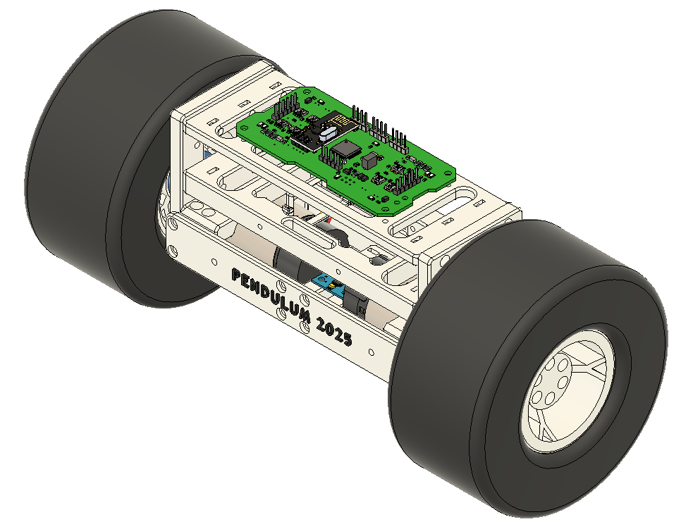

# 🚀 PENDULUM ROBOT 2025

Welcome to **PENDULUM ROBOT** — an Inverted Pendulum two wheeled robot as next version to 2024 model. This repository contains the source code and resources for it. Whether you're a developer, contributor, or just curious, this README will help you get started.

 

## 📦 Features

- 🏗️ 3D printed inverted pendulum body
- 💻 Custom PCB with MCU, PSU, Motor Drivers etc.
- 🚦 80MHz ARM Cortex-M0+ MCU by Texas Instruments
- ✈️ IMU based on MPU6050
- 🎛️ Nested cascade P-PD controller implemented
- 🪒 Model based controller design (Matlab)
- 🧮 Mathematical model representation by STATE SPACE
- 🚗 2x 12V POLOLU DC motors for each wheel
- 🔋 12V Li-Ion battery 1300mAh

## 🕹 PCB Detail

## 🔧 Body Diagram

